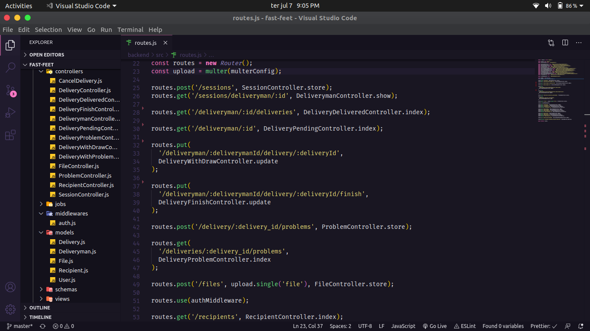

<h1 align="center">
    
</h1>

<p align="center">
  <a href="https://github.com/ronnyacacio">
    
  </a>

  <a href="#">
    
  </a>

  <a href="https://github.com/ronnyacacio/fast-feet/stargazers">
    
  </a>

  <a href="https://github.com/ronnyacacio/fast-feet/commits/master">
    
  </a>

  <a href="#">
    
  </a>

  <a href="https://github.com/ronnyacacio/fast-feet/blob/master/LICENSE.md">
    
  </a>
</p>

<br />

## 💻 Projeto

O FastFeet é um projeto que visa gerenciar as encomendas e entregas de uma transportadora. Onde a sede "fastfeet" utiliza a parte WEB enquanto os entregadores usam o app mobile para dar feedback de problemas ou sucesso na entrega dos produtos.

</br>

## ⛏ API

<h1 align="center">
    
</h1>

## 🌐 WEB

<h1 align="center">
    
</h1>

## 📱 Mobile

<h1 align="center">
    
</h1>

## 🚀 Pricipais Tecnologias

- [React](https://reactjs.org)
- [Node](https://nodejs.org/en/)
- [Expo](https://docs.expo.io/)
- [Styled Components](https://styled-components.com/)
- [Axios](https://github.com/axios/axios)
- [Date-fns](https://date-fns.org/)
- [JsonWebToken](https://github.com/auth0/node-jsonwebtoken)
- [Sequelize](https://sequelize.org/)
- [Express](https://expressjs.com/pt-br/)
- [Multer](https://www.npmjs.com/package/multer)
- [Bee-queue](https://github.com/bee-queue/bee-queue)
- [NodeMailer](https://nodemailer.com/about/)
- [Redux](https://redux.js.org/)
- [Redux-saga](https://redux-saga.js.org/)
- [UnForm](https://github.com/Rocketseat/unform)
- [React Router DOM](https://reacttraining.com/react-router/web/guides/quick-start)
- [React Navigation](https://reactnavigation.org/)

<br />

## 🔥 Instalação

```bash
# Clone este repositório
$ git clone https://github.com/ronnyacacio/fast-feet.git

# Crie um arquivo .env na pasta backend e o preencha conforme o arquivo .env.example
# Crie um banco de dados postgres na sua máquina com o nome fast-feet

# Navegue até a pasta backend e execute os seguintes comandos:
$ yarn
$ yarn sequelize db:migrate
$ yarn sequelize db:seed:all
$ yarn dev
$ yarn queue

# Depois disso, entre na pasta web e execute os comandos:
$ yarn
$ yarn start

# E finalmente, entre na pasta mobile e execunte os comandos:
$ yarn
$ expo start

# Observações:
- Não esqueça de mudar a baseURL no arquivo `src/services/api.js` da pasta e mobile para o IP da sua máquina
```

<p align="center">
  Made with 💜 by <a href="https://www.linkedin.com/in/ronnyacacio/"> Ronny Acácio </a>
</p>
